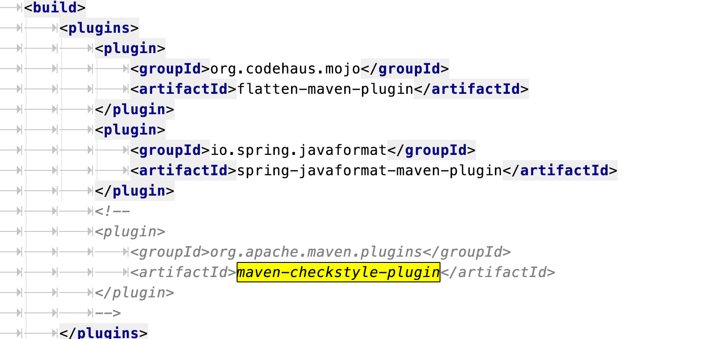

## **spring cloud gateway源码阅读的准备工作**

## fork代码并本地编译成功

github fork到自己的repo，然后在本地：

> git clone https://github.com/evasnowind/spring-cloud-gateway
>
> cd spring-cloud-gateway
>
> git fetch origin v2.2.6.RELEASE:v2.2.6.RELEASE
>
> git checkout v2.2.6.RELEASE 

### 本地编译可能遇到checkstyle报错

解决方法

方法1：注释掉checkstyle plugin

方法2：官方提供的方案

