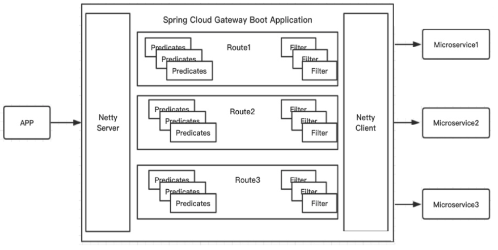

## **spring cloud gateway基础**

spring cloud gateway（后续简称SCG）本身就是spring cloud体系的一员，在对于java技术栈的系统使用起来比较方便，此外，SCG扩展性比较好，适合作为**业务网关**的基础、根据自身需求进行二次开发。 

### 关键组成部分

- 谓词 predicate: 将请求匹配到对应的route上
- 路由 route: 网关的基本构建块。它由ID，目标URI，谓词集合和过滤器集合定义
- 过滤器 filter: 由特定工厂构造生成

### 工作过程

- 1. SCG接收客户端请求。
- 2. 请求与谓词匹配，获得对应的路由，匹配成功后，继续往下执行。
- 3. 请求交给前置filter处理
- 4. 请求经过代理服务（类似与RPC），发送给目标URI
- 5. 响应交给后置filter处理
- 6. SCG将响应返回给客户端

### 应用场景

- 灰度发布
  - 可以使用Weight Route Predicate实现
- 请求限流
- 服务容错
  - 结合Sentinel或是Hystrix，基于令牌桶算法

### 其他

- 监控

- 故障排查
  - 通过日志	
  - Wiretap

## 参考资料

- [如何评价 spring cloud gateway? 对比 zuul2.0 主要的优势是什么?](https://www.zhihu.com/question/280850489/answer/522263176)
- [Spring Cloud Gateway组成](https://blog.csdn.net/W_317/article/details/108691740)
- [芋道 Spring Cloud 网关 Spring Cloud Gateway 入门](http://www.iocoder.cn/Spring-Cloud/Spring-Cloud-Gateway/?self#)