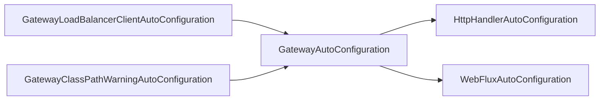
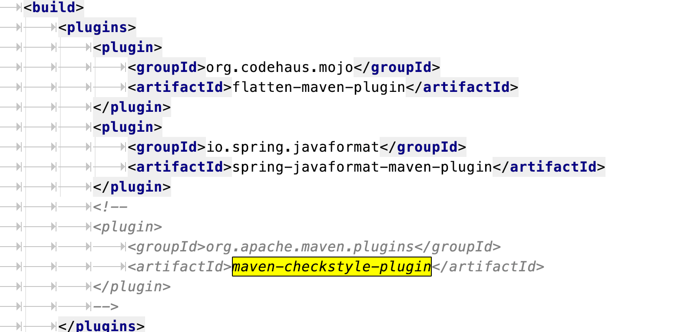

## Spring Cloud Gateway的初始化过程

Spring Cloud Gateway(以下简称SCG)作为Spring Cloud的一部分，遵循Spring Boot的约定，使用Spring Factories机制，以简化该组件的初始化。

> 有关Spring Factories机制，可以参考我这篇文章：[源码分析之Spring Boot如何利用Spring Factories机制进行自动注入](https://blog.csdn.net/evasnowind/article/details/108647194?ops_request_misc=%257B%2522request%255Fid%2522%253A%2522160923376216780288798756%2522%252C%2522scm%2522%253A%252220140713.130102334.pc%255Fblog.%2522%257D&request_id=160923376216780288798756&biz_id=0&utm_medium=distribute.pc_search_result.none-task-blog-2~blog~first_rank_v1~rank_blog_v1-1-108647194.pc_v1_rank_blog_v1&utm_term=factories)

SCG的自动装配类是`GatewayAutoConfiguration`，对应配置类`GatewayProperties`。

> 注：若无特别指明，本文涉及的SCG版本为v2.2.6.release

```java
@Configuration(proxyBeanMethods = false)
@ConditionalOnProperty(name = "spring.cloud.gateway.enabled", matchIfMissing = true)
@EnableConfigurationProperties
@AutoConfigureBefore({ HttpHandlerAutoConfiguration.class,
		WebFluxAutoConfiguration.class })
@AutoConfigureAfter({ GatewayLoadBalancerClientAutoConfiguration.class,
		GatewayClassPathWarningAutoConfiguration.class })
@ConditionalOnClass(DispatcherHandler.class)
public class GatewayAutoConfiguration {
    ......
}
```

根据GatewayAutoConfiguration上的注解，可以得知，初始化时主要涉及如下组件的加载：

```text
GatewayLoadBalancerClientAutoConfiguration,GatewayClassPathWarningAutoConfiguration

GatewayAutoConfiguration

HttpHandlerAutoConfiguration, WebFluxAutoConfiguration
```

初始化顺序如下（通过@AutoConfigureBefore @AutoConfigureAfter 两个注解指定）



那我们挨个看每个AutoConfiguration里做了哪些初始化操作即可。

### 关键的几个AutoConfiguration

#### 1.  GatewayLoadBalancerClientAutoConfiguration

创建一个LoadBalancerClientFilter对象，从LoadBalancerClientFilter源码看，目前v2.2.6中该类已经被废弃，被替换为ReactiveLoadBalancerClientFilter。

ReactiveLoadBalancerClientFilter是一个GlobalFilter, 使用了reactive Spring Cloud。

#### 2. GatewayClassPathWarningAutoConfiguration

Spring Cloud Gateway 2.x 基于 Spring WebFlux 实现。GatewayClassPathWarningAutoConfiguration用于检查项目是否**正确**导入 `spring-boot-starter-webflux` 依赖，而不是错误**导入** `spring-boot-starter-web` 依赖。

#### 3. GatewayAutoConfiguration

最重要的初始化类，初始化n多对象，创建过滤器、过滤器工厂等，挑一些关键的：

- RouteDefinitionLocator
- RouteLocator
- RoutePredicateHandlerMapping
- FilteringWebHandler
- GlobalFilter
- GatewayFilter

#### 4. HttpHandlerAutoConfiguration

HttpHandler

#### 5. WebFluxAutoConfiguration

初始化WebFlux。


### 整体流程

注：引自https://blog.csdn.net/qq_19663899/article/details/107939654

>gateway启动的过程其实就是构建对象然后将各个模块拼装到一起交给**RoutePredicateHandlerMapping**
>
>```text
>  1. create route definition and collect
>  2. collect resource and compose RouteDefinitionRouteLocator
>  3. init filter handler
>  4. compose handler mapping
>  5. add refresh event listener
>  6. add HttpHeaderFilter beans
>  7. init GlobalFilter beans
>  8. init Predicate Factory beans
>  9. init GatewayFilter Factory beans
>```


### 如何自己看源码、调试？

推荐做法如下：

github fork到自己的repo，然后在本地：

> git clone https://github.com/xxxx/spring-cloud-gateway
>
> cd spring-cloud-gateway
>
> git fetch origin v2.2.6.RELEASE:v2.2.6.RELEASE
>
> git checkout v2.2.6.RELEASE

然后本地编译，可能遇到checkstyle报错，可以将项目中的maven-checkstyle-plugin注释掉，再重新编译。

编译时，简单起见可以使用`mvnw clean package -DskipTests=true`这条命令跳过测试，平时开源框架编译我经常这么搞，可以省去不少时间。其中`mvnw`可以自动选取maven的版本。




## 参考资料

- [Spring-Cloud-Gateway 源码解析 —— 网关初始化](http://www.iocoder.cn/Spring-Cloud-Gateway/init/)
- [Spring Cloud Gateway自动配置类解读](https://blog.csdn.net/ttyy1112/article/details/99673865)
  - 推荐这篇，整体流程、具体代码结合的比较好。


### 笔记

```text

@Configuration的proxyBeanMethods是用来指定@Bean注解标注的方法是否使用代理，默认是true使用代理，直接从IOC容器之中取得对象；如果设置为false,也就是不使用注解，每次调用@Bean标注的方法获取到的对象和IOC容器中的都不一样，是一个新的对象，所以我们可以将此属性设置为false来提高性能；
参见：https://blog.csdn.net/yaomingyang/article/details/108238121


@AutoConfigureBefore 和 @AutoConfigureAfter 是 spring-boot-autoconfigure 包下的注解
@AutoConfigureBefore(AAAA.class) 或 AutoConfigureBefore({AAAA.class, BBBB.class})
@AutoConfigureBefore(AAAA.class)
public class CCCC {
}
说明 CCCC 将会在 AAAA 之前加载

@AutoConfigureAfter则相反。
参见：https://blog.csdn.net/yangchao1125/article/details/100934881


@ConditionalOnClass 是Springboot实现自动配置的重要支撑之一。其用途是判断当前classpath下是否存在指定类，若是则将当前的配置装载入spring容器。举例来说，如果在maven中引入了velocity，那么视图就使用velocity，若引入的是freemarker，则使用freemarker.
参见：https://blog.csdn.net/lucyTheSlayer/article/details/80430912
```


