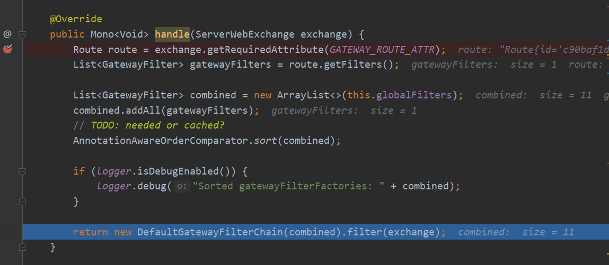
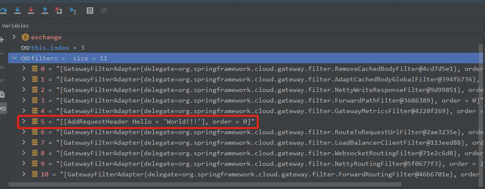
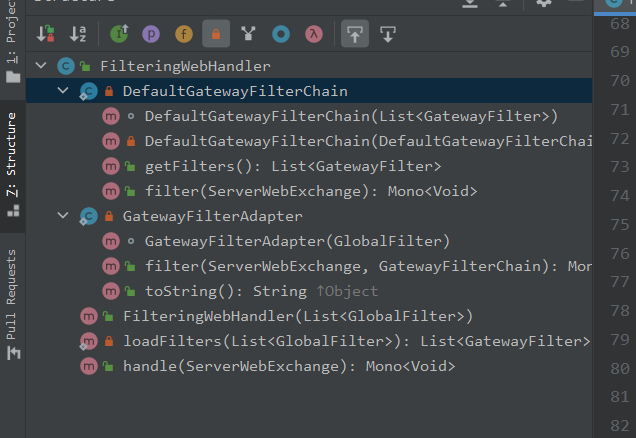

## **Spring Cloud Gateway源码分析(二)之请求被路由的过程解析**

简单起见，直接使用Spring Cloud Gateway(以下简称SCG)框架自带的spring-cloud-gateway-sample模块进行源码分析。

## 目标

走一遍一个请求在SCG中被解析、路由的主流程，了解整体框架。

## 事先准备

可以做如下改造：

1、修改yaml文件

`test.uri`的值修改为：`http://httpbin.org:80`

即

```yaml
test:
  #  hostport: httpbin.org:80
  #  hostport: localhost:5000
  #  uri: http://${test.hostport}
#  uri: lb://httpbin
  uri: http://httpbin.org:80
```

2、去掉默认过滤器的前缀

```yaml
      default-filters:
#      - PrefixPath=/httpbin
      - PrefixPath=/
```

3、注释掉GatewaySampleApplication中customRouteLocator的@Bean，然后自定义一个简单的route，内容如下：

```java
	@Bean
	public RouteLocator myRoutes(RouteLocatorBuilder builder) {
		String httpUri = "http://httpbin.org:80";
		return builder.routes()
				.route(p -> p
						.path("/get")
						.filters(f -> f.addRequestHeader("Hello", "World!!!"))
						.uri(httpUri)
				)
				.build();
	}

//此处暂时注释掉，避免其他干扰
//	@Bean
	public RouteLocator customRouteLocator(RouteLocatorBuilder builder) {
        ......
    }
```

然后启动GatewaySampleApplication即可。

启动后，本地验证下，可以得到如下结果，则说明当前网关的路由设置成功：

```shell
$ curl http://localhost:8080/get

{
  "args": {},
  "headers": {
    "Accept": "*/*",
    "Content-Length": "0",
    "Forwarded": "proto=http;host=\"localhost:8080\";for=\"0:0:0:0:0:0:0:1:10587\"",
    "Hello": "World!!!",
    "Host": "httpbin.org",
    "User-Agent": "curl/7.73.0",
    "X-Amzn-Trace-Id": "Root=1-5fedfe3c-3c95f39238160e857879c36d",
    "X-Forwarded-Host": "localhost:8080"
  },
  "origin": "0:0:0:0:0:0:0:1, 123.11.117.113",
  "url": "http://localhost:8080/get"
}
```


## 分析过程

### 1. 找到路由

发起上面的`http://localhost:8080/get`请求后，观察GatewaySampleApplication的运行日志，可以看到如下内容（包含后面分析所需的内容）：

```text
o.s.c.g.f.WeightCalculatorWebFilter      : Weights attr: {}
o.s.c.g.h.p.RoutePredicateFactory        : Pattern "/get" matches against value "/get"
o.s.c.g.h.RoutePredicateHandlerMapping   : Route matched: d35875b2-6202-4a7f-a48d-02c9b523bee1
o.s.c.g.h.RoutePredicateHandlerMapping   : Mapping [Exchange: GET http://localhost:8080/get] to Route{id='d35875b2-6202-4a7f-a48d-02c9b523bee1', uri=http://httpbin.org:80, order=0, predicate=Paths: [/get], match trailing slash: true, gatewayFilters=[[[AddRequestHeader Hello = 'World!!!'], order = 0]], metadata={}}
o.s.c.g.h.RoutePredicateHandlerMapping   : [403bdc55-2] Mapped to org.springframework.cloud.gateway.handler.FilteringWebHandler@10f3ad1a
o.s.c.g.handler.FilteringWebHandler      : Sorted gatewayFilterFactories: [[GatewayFilterAdapter{delegate=org.springframework.cloud.gateway.filter.RemoveCachedBodyFilter@7b9088f2}, order = -2147483648], [GatewayFilterAdapter{delegate=org.springframework.cloud.gateway.filter.AdaptCachedBodyGlobalFilter@47df5041}, order = -2147482648], [GatewayFilterAdapter{delegate=org.springframework.cloud.gateway.filter.NettyWriteResponseFilter@2725ca05}, order = -1], [GatewayFilterAdapter{delegate=org.springframework.cloud.gateway.filter.ForwardPathFilter@4a2bf50f}, order = 0], [GatewayFilterAdapter{delegate=org.springframework.cloud.gateway.filter.GatewayMetricsFilter@2506b881}, order = 0], [[AddRequestHeader Hello = 'World!!!'], order = 0], [GatewayFilterAdapter{delegate=org.springframework.cloud.gateway.filter.RouteToRequestUrlFilter@1a914089}, order = 10000], [GatewayFilterAdapter{delegate=org.springframework.cloud.gateway.filter.LoadBalancerClientFilter@fddd7ae}, order = 10100], [GatewayFilterAdapter{delegate=org.springframework.cloud.gateway.filter.WebsocketRoutingFilter@350323a0}, order = 2147483646], [GatewayFilterAdapter{delegate=org.springframework.cloud.gateway.filter.NettyRoutingFilter@3f6cce7f}, order = 2147483647], [GatewayFilterAdapter{delegate=org.springframework.cloud.gateway.filter.ForwardRoutingFilter@43d76a92}, order = 2147483647]]
o.s.c.g.filter.RouteToRequestUrlFilter   : RouteToRequestUrlFilter start
r.n.resources.PooledConnectionProvider   : [id: 0xdbe9e412] Created a new pooled channel, now 1 active connections and 0 inactive connections
reactor.netty.channel.BootstrapHandlers  : [id: 0xdbe9e412] Initialized pipeline DefaultChannelPipeline{(BootstrapHandlers$BootstrapInitializerHandler#0 = reactor.netty.channel.BootstrapHandlers$BootstrapInitializerHandler), (PooledConnectionProvider$PooledConnectionAllocator$PooledConnectionInitializer#0 = reactor.netty.resources.PooledConnectionProvider$PooledConnectionAllocator$PooledConnectionInitializer), (reactor.left.httpCodec = io.netty.handler.codec.http.HttpClientCodec), (reactor.right.reactiveBridge = reactor.netty.channel.ChannelOperationsHandler)}
r.n.resources.PooledConnectionProvider   : [id: 0xdbe9e412, L:/192.168.2.143:10588 - R:httpbin.org/54.158.248.248:80] Registering pool release on close event for channel
r.n.resources.PooledConnectionProvider   : [id: 0xdbe9e412, L:/192.168.2.143:10588 - R:httpbin.org/54.158.248.248:80] Channel connected, now 1 active connections and 0 inactive connections
r.n.resources.PooledConnectionProvider   : [id: 0xdbe9e412, L:/192.168.2.143:10588 - R:httpbin.org/54.158.248.248:80] onStateChange(PooledConnection{channel=[id: 0xdbe9e412, L:/192.168.2.143:10588 - R:httpbin.org/54.158.248.248:80]}, [connected])
r.n.resources.PooledConnectionProvider   : [id: 0xdbe9e412, L:/192.168.2.143:10588 - R:httpbin.org/54.158.248.248:80] onStateChange(GET{uri=/, connection=PooledConnection{channel=[id: 0xdbe9e412, L:/192.168.2.143:10588 - R:httpbin.org/54.158.248.248:80]}}, [configured])
r.netty.http.client.HttpClientConnect    : [id: 0xdbe9e412, L:/192.168.2.143:10588 - R:httpbin.org/54.158.248.248:80] Handler is being applied: {uri=http://httpbin.org/get, method=GET}
r.n.resources.PooledConnectionProvider   : [id: 0xdbe9e412, L:/192.168.2.143:10588 - R:httpbin.org/54.158.248.248:80] onStateChange(GET{uri=/get, connection=PooledConnection{channel=[id: 0xdbe9e412, L:/192.168.2.143:10588 - R:httpbin.org/54.158.248.248:80]}}, [request_prepared])
o.s.c.gateway.filter.NettyRoutingFilter  : outbound route: dbe9e412, inbound: [403bdc55-2] 
reactor.netty.channel.FluxReceive        : [id: 0x403bdc55, L:/[0:0:0:0:0:0:0:1]:8080 - R:/[0:0:0:0:0:0:0:1]:10587] Subscribing inbound receiver [pending: 0, cancelled:false, inboundDone: true]
r.n.resources.PooledConnectionProvider   : [id: 0xdbe9e412, L:/192.168.2.143:10588 - R:httpbin.org/54.158.248.248:80] onStateChange(GET{uri=/get, connection=PooledConnection{channel=[id: 0xdbe9e412, L:/192.168.2.143:10588 - R:httpbin.org/54.158.248.248:80]}}, [request_sent])
r.n.http.client.HttpClientOperations     : [id: 0xdbe9e412, L:/192.168.2.143:10588 - R:httpbin.org/54.158.248.248:80] Received response (auto-read:false) : [Server=, Date=Thu, 31 Dec 2020 16:37:16 GMT, Content-Type=application/json, Content-Length=458, Connection=keep-alive, Access-Control-Allow-Origin=*, Access-Control-Allow-Credentials=true]
r.n.resources.PooledConnectionProvider   : [id: 0xdbe9e412, L:/192.168.2.143:10588 - R:httpbin.org/54.158.248.248:80] onStateChange(GET{uri=/get, connection=PooledConnection{channel=[id: 0xdbe9e412, L:/192.168.2.143:10588 - R:httpbin.org/54.158.248.248:80]}}, [response_received])
o.s.c.g.filter.NettyWriteResponseFilter  : NettyWriteResponseFilter start inbound: dbe9e412, outbound: [403bdc55-2] 
reactor.netty.channel.FluxReceive        : [id: 0xdbe9e412, L:/192.168.2.143:10588 - R:httpbin.org/54.158.248.248:80] Subscribing inbound receiver [pending: 0, cancelled:false, inboundDone: false]
r.n.http.client.HttpClientOperations     : [id: 0xdbe9e412, L:/192.168.2.143:10588 - R:httpbin.org/54.158.248.248:80] Received last HTTP packet
o.s.c.g.filter.GatewayMetricsFilter      : gateway.requests tags: [tag(httpMethod=GET),tag(httpStatusCode=200),tag(outcome=SUCCESSFUL),tag(routeId=d35875b2-6202-4a7f-a48d-02c9b523bee1),tag(routeUri=http://httpbin.org:80),tag(status=OK)]
r.n.resources.PooledConnectionProvider   : [id: 0xdbe9e412, L:/192.168.2.143:10588 - R:httpbin.org/54.158.248.248:80] onStateChange(GET{uri=/get, connection=PooledConnection{channel=[id: 0xdbe9e412, L:/192.168.2.143:10588 - R:httpbin.org/54.158.248.248:80]}}, [response_completed])
r.n.resources.PooledConnectionProvider   : [id: 0xdbe9e412, L:/192.168.2.143:10588 - R:httpbin.org/54.158.248.248:80] onStateChange(GET{uri=/get, connection=PooledConnection{channel=[id: 0xdbe9e412, L:/192.168.2.143:10588 - R:httpbin.org/54.158.248.248:80]}}, [disconnecting])
r.n.resources.PooledConnectionProvider   : [id: 0xdbe9e412, L:/192.168.2.143:10588 - R:httpbin.org/54.158.248.248:80] Releasing channel
r.n.resources.PooledConnectionProvider   : [id: 0xdbe9e412, L:/192.168.2.143:10588 - R:httpbin.org/54.158.248.248:80] Channel cleaned, now 0 active connections and 1 inactive connections
r.n.http.server.HttpServerOperations     : [id: 0x403bdc55, L:/[0:0:0:0:0:0:0:1]:8080 - R:/[0:0:0:0:0:0:0:1]:10587] Last HTTP response frame
r.n.http.server.HttpServerOperations     : [id: 0x403bdc55, L:/[0:0:0:0:0:0:0:1]:8080 - R:/[0:0:0:0:0:0:0:1]:10587] Decreasing pending responses, now 0
r.n.http.server.HttpServerOperations     : [id: 0x403bdc55, L:/[0:0:0:0:0:0:0:1]:8080 - R:/[0:0:0:0:0:0:0:1]:10587] Last HTTP packet was sent, terminating the channel
r.n.resources.PooledConnectionProvider   : [id: 0xdbe9e412, L:/192.168.2.143:10588 ! R:httpbin.org/54.158.248.248:80] onStateChange(PooledConnection{channel=[id: 0xdbe9e412, L:/192.168.2.143:10588 ! R:httpbin.org/54.158.248.248:80]}, [disconnecting])
```

此处可以看到，在第2行进行了匹配操作，日志中提示这一步操作是`RoutePredicateFactory`完成的。我们读过SCG官方文档后就会知道，SCG中的匹配操作由谓词（predicate）完成，谓词有多种类型，并且是由谓词工厂类产生，具体可以参考 https://docs.spring.io/spring-cloud-gateway/docs/2.2.5.RELEASE/reference/html/#gateway-request-predicates-factories 。此处对于谓词的解析暂且放过，留待后续解析。

接着，我们可以看到日志中接下来走到`RoutePredicateHandlerMapping`，这行提示`Route matched`， 那看下源码，在该类中搜索`Route matched`，可以看到这个方法：

```java
	protected Mono<Route> lookupRoute(ServerWebExchange exchange) {
		return this.routeLocator.getRoutes()
				// individually filter routes so that filterWhen error delaying is not a
				// problem
				.concatMap(route -> Mono.just(route).filterWhen(r -> {
					// add the current route we are testing
					exchange.getAttributes().put(GATEWAY_PREDICATE_ROUTE_ATTR, r.getId());
					return r.getPredicate().apply(exchange);
				})
						// instead of immediately stopping main flux due to error, log and
						// swallow it
						.doOnError(e -> logger.error(
								"Error applying predicate for route: " + route.getId(),
								e))
						.onErrorResume(e -> Mono.empty()))
				// .defaultIfEmpty() put a static Route not found
				// or .switchIfEmpty()
				// .switchIfEmpty(Mono.<Route>empty().log("noroute"))
				.next()
				// TODO: error handling
				.map(route -> {
					if (logger.isDebugEnabled()) {
						logger.debug("Route matched: " + route.getId());
					}
					validateRoute(route, exchange);
					return route;
				});

		/*
		 * TODO: trace logging if (logger.isTraceEnabled()) {
		 * logger.trace("RouteDefinition did not match: " + routeDefinition.getId()); }
		 */
	}
```

可以看出，`lookupRoute`方法根据输入找到对应路由，此处使用了Reactor库进行反应式编程，具体的代码解析留待后续，我们先继续走主要脉络。

### 2. 找到filter

继续看日志，可以看到下面几行（已删掉部分内容，完整日志参见上面）：

```text
o.s.c.g.h.RoutePredicateHandlerMapping   : [403bdc55-2] Mapped to org.springframework.cloud.gateway.handler.FilteringWebHandler@10f3ad1a
o.s.c.g.handler.FilteringWebHandler      : Sorted gatewayFilterFactories: //省略n多内容
o.s.c.g.filter.RouteToRequestUrlFilter   : RouteToRequestUrlFilter start
```

可以这里可以看到，走完RoutePredicateHandlerMapping、匹配到路由后，接下来就是走到`FilteringWebHandler`，即去找filter。那么查看`FilteringWebHandler`源码，在该类中搜索文本`Sorted gatewayFilterFactories` ，可以看到是在`handle`方法中：

```java
public class FilteringWebHandler implements WebHandler {
	......
	@Override
	public Mono<Void> handle(ServerWebExchange exchange) {
		Route route = exchange.getRequiredAttribute(GATEWAY_ROUTE_ATTR);
		List<GatewayFilter> gatewayFilters = route.getFilters();

		List<GatewayFilter> combined = new ArrayList<>(this.globalFilters);
		combined.addAll(gatewayFilters);
		// TODO: needed or cached?
		AnnotationAwareOrderComparator.sort(combined);

		if (logger.isDebugEnabled()) {
			logger.debug("Sorted gatewayFilterFactories: " + combined);
		}

		return new DefaultGatewayFilterChain(combined).filter(exchange);
	}
    ......
}
```

我们打下断点，发个请求、重新debug，果然走到了这里：



此处可以看出，SCG果然也是用filter-chain的方式来调用filter，那先在此处看下目前有哪些filter，看IDEA的debug窗口，我发现如下内容：



有没有很意外！debug里已经显示出目前`AddRequestHeader`里有我们自己定义的一个header 内容，那么很明显，我们不用挨个去debug每个filter，直接找到`AddRequestHeaderGatewayFilterFactory`，打上断点，就可以定位到请求中添加header的代码，关键代码在这里：

```java
public class AddRequestHeaderGatewayFilterFactory
		extends AbstractNameValueGatewayFilterFactory {

	@Override
	public GatewayFilter apply(NameValueConfig config) {
		return new GatewayFilter() {
			@Override
			public Mono<Void> filter(ServerWebExchange exchange,
					GatewayFilterChain chain) {
                /*
                在filter方法中执行具体的业务逻辑，比如AddRequestHeaderGatewayFilterFactory
                创建的GatewayFilter，是要添加一个HTTP header。
                执行完自己的逻辑后，还需要调用filter chain的filter方法，
                保证后续的filter能继续执行。
				 */
				String value = ServerWebExchangeUtils.expand(exchange, config.getValue());
				ServerHttpRequest request = exchange.getRequest().mutate()
						.header(config.getName(), value).build();

				return chain.filter(exchange.mutate().request(request).build());
			}
		};
	}
}
```

到此处，我们就可以看到，SCG中的`AddRequestHeaderGatewayFilterFactory`，并没有创建具体的类，而是在工厂类中创建一个匿名类实现了GatewayFilter接口、实现添加HTTP header的具体逻辑。

所以小结一下，SCG中filter是通过FilteringWebHandler类把所有filter加载进来、通过filter chain的方式挨个处理。

那么此处就有一个问题，SCG中是有n多个filter，这些filter的先后顺序是如何保证的？

#### 2.1 SCG如何添加一个filter

此处就需要查看SCG是如何添加一个filter的。我们回到最开始，本文示例代码中添加filter的代码如下：

```java
	@Bean
	public RouteLocator myRoutes(RouteLocatorBuilder builder) {
		String httpUri = "http://httpbin.org:80";
		return builder.routes()
				.route(p -> p
						.path("/get")
                       //看看这里的源码
						.filters(f -> f.addRequestHeader("Hello", "World!!!"))
						.uri(httpUri)
				)
				.build();
	}
```

点下`filters()`方法，好像跟添加filter、filter排序关系都不大，暂时跳过：

```java
	public UriSpec filters(Function<GatewayFilterSpec, UriSpec> fn) {
		return fn.apply(new GatewayFilterSpec(routeBuilder, builder));
	}
```

那再看下`addRequestHeader`， 明显这里就是添加filter、并涉及排序的代码了：

```java

public class UriSpec {
    .......
    /*
     getBean方法来自UriSpec
        */
    <T> T getBean(Class<T> type) {
        return this.builder.getContext().getBean(type);
    }
	.......
}

public class GatewayFilterSpec extends UriSpec {
    ......
    /**
    获取AddRequestHeaderGatewayFilterFactory，
	将用户传入的键值对创建出一个AbstractNameValueGatewayFilterFactory.NameValueConfig对象，
	作为AddRequestHeaderGatewayFilterFactory#apply方法的输入。
	
	 * Adds a request header to the request before it is routed by the Gateway.
	 * @param headerName the header name
	 * @param headerValue the header value
	 * @return a {@link GatewayFilterSpec} that can be used to apply additional filters
	 */
    public GatewayFilterSpec addRequestHeader(String headerName, String headerValue) {
        return filter(getBean(AddRequestHeaderGatewayFilterFactory.class)
                      .apply(c -> c.setName(headerName).setValue(headerValue)));
    }
    
    /**
	 * Applies the filter to the route.
	 * @param gatewayFilter the filter to apply
	 * @return a {@link GatewayFilterSpec} that can be used to apply additional filters
	 */
	public GatewayFilterSpec filter(GatewayFilter gatewayFilter) {
		if (gatewayFilter instanceof Ordered) {
			this.routeBuilder.filter(gatewayFilter);
			return this;
		}
		return this.filter(gatewayFilter, 0);
	}
    ......
}
```

此处我们再结合GatewayFilterFactory接口定义和AddRequestHeaderGatewayFilterFactory类定义：

```java
@FunctionalInterface
public interface GatewayFilterFactory<C> extends ShortcutConfigurable, Configurable<C> {
    ......
	GatewayFilter apply(C config);
    ......
}

public class AddRequestHeaderGatewayFilterFactory	extends AbstractNameValueGatewayFilterFactory {
    //public abstract class AbstractNameValueGatewayFilterFactory extends AbstractGatewayFilterFactory<AbstractNameValueGatewayFilterFactory.NameValueConfig>
	.....
}
```

聊聊此处代码涉及的细节：

1. `GatewayFilterFactory`被标注为函数式接口，则该接口只能有一个方法是抽象的，此处为`apply(C config)`方法
2. `GatewayFilterFactory`接口声明时定义了泛型，子类需要给出具体类型，而`AddRequestHeaderGatewayFilterFactory`继承的`AbstractNameValueGatewayFilterFactory`指定了具体类型为`AbstractNameValueGatewayFilterFactory.NameValueConfig`。因此我们会看到，在`AddRequestHeaderGatewayFilterFactory`中的apply定义是`public GatewayFilter apply(NameValueConfig config)`。
3. 实现了`@FunctionalInterface`，所以`AddRequestHeaderGatewayFilterFactory`支持Lambda写法。
4. `GatewayFilterSpec`#`filter`中，有判断是否实现了`Ordered`接口，若实现了，则调用`Route.AsyncBuilder`#`filter(GatewayFilter gatewayFilter)`接口。若没实现该接口，调用本类中的`filter(gatewayFilter, 0)`方法，而这个方法其实只是加了个默认值、最终还是会调用`Route.AsyncBuilder`#`filter(GatewayFilter gatewayFilter)`接口。

那么此处我们知道，有`Ordered`接口可以指定filter的执行顺序，并且若不实现该接口、则默认顺序值是0。

进一步追踪`Route.AsyncBuilder`#`filter(GatewayFilter gatewayFilter)`方法，可以看到该方法会将传入的`GatewayFilter `添加到`Route`的`ArrayList`类型的` gatewayFilters`成员变量中，并没有其他操作。

所以，**`GatewayFilterSpec`中的`filter`方法实际上只是将`filter`添加到`Route`的` gatewayFilters`成员变量中。**

#### 2.2 SCG中filter如何排序

到目前位置，我们知道了`filter`如何添加到`Route`中，但还是没看到`filter`是如何排序的。我们可以搜一下使用`gatewayFilters`的代码。首先看下`Route`：

```java
public class Route implements Ordered {
    ......
    public List<GatewayFilter> getFilters() {
		return Collections.unmodifiableList(this.gatewayFilters);
	}
    .....
}
```

此处有个小细节，外部调用`Route`的filter列表时，调用的`getFilters`方法会返回一个只读视图、不容许修改filter列表。

在SCG源码中搜索`getFilters`，排除掉测试类、排除掉actuate这种明显不可能与主体逻辑相关的代码，可以看到一个很熟悉的类`FilterWebHandler`：


但该类中还有其他方法，看上去好像也跟找到所需filter也有关系，如下图：



比如handle, loadFilters， 还有两个子类中的filter方法，在没有仔细分析代码前，看方法名可能都跟查找filter有点干系，那我暂时先都加个断点，然后debug下，于是果然不出所料：


走到这一步，我们基本可以清楚filter逻辑是怎么加到请求中，但接下来的问题是：请求怎么发出去呢？

### 3. 请求的发送

这一步就要回到刚刚我们看到过的11个默认的filter：

```
RemoveCachedBodyFilter
AdaptCachedBodyGlobalFilter
NettyWriteResponseFilter
ForwardPathFilter
GatewayMetricsFilter
AddRequestHeader
RouteToRequestUrlFilter
LoadBalancerClientFilter
WebsocketRoutingFilter
NettyRoutingFilter
ForwardRoutingFilter
```

这11个filter中，NettyRoutingFilter看上去跟网络请求有关（此处主要是参考自[https://github.com/lw1243925457/SE-Notes/blob/master/profession/program/java/spring/springcloudGateway/%E6%B5%81%E7%A8%8B%E7%B1%BB.md](https://github.com/lw1243925457/SE-Notes/blob/master/profession/program/java/spring/springcloudGateway/流程类.md)  ，我没有来得及挨个去debug代码）

2021.1.1 TO BE Continue....


## 后续TODO

- SCG中的谓词如何匹配请求，如何找到对应的路由？分析`RoutePredicateHandlerMapping`中的`lookupRoute`方法源码
- 分析FilteringWebHandler处理过程，filter chain如何实现？默认filter是如何一步步加载进来的？用户自定义filter是如何加到整个filter chain的？
- 
- 


## 参考资料

- [https://github.com/lw1243925457/SE-Notes/blob/master/profession/program/java/spring/springcloudGateway/%E6%B5%81%E7%A8%8B%E7%B1%BB.md](https://github.com/lw1243925457/SE-Notes/blob/master/profession/program/java/spring/springcloudGateway/流程类.md)