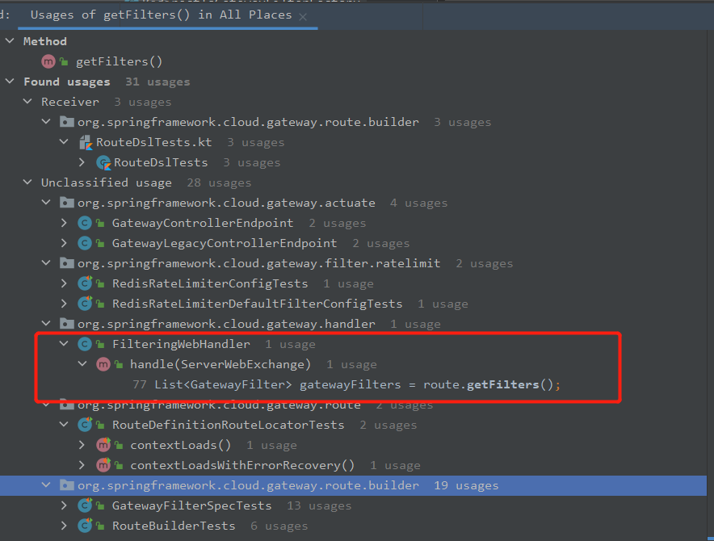

## **Spring Cloud Gateway源码分析(四)之filter是如何工作的**

简单起见，直接使用Spring Cloud Gateway(以下简称SCG)框架自带的spring-cloud-gateway-sample模块进行源码分析。

## 目标

分析如何添加filter，filter如何排序，filter如何执行

## 事先准备

参见

## 分析过程

### SCG如何添加一个filter

我们回到最开始，本文示例代码中添加filter的代码如下：

```java
	@Bean
	public RouteLocator myRoutes(RouteLocatorBuilder builder) {
		String httpUri = "http://httpbin.org:80";
		return builder.routes()
				.route(p -> p
						.path("/get")
                       //看看这里的源码
						.filters(f -> f.addRequestHeader("Hello", "World!!!"))
						.uri(httpUri)
				)
				.build();
	}
```

点下`filters()`方法，好像跟添加filter、filter排序关系都不大，暂时跳过：

```java
	public UriSpec filters(Function<GatewayFilterSpec, UriSpec> fn) {
		return fn.apply(new GatewayFilterSpec(routeBuilder, builder));
	}
```

那再看下`addRequestHeader`， 明显这里就是添加filter、并涉及排序的代码了：

```java

public class UriSpec {
    .......
    /*
     getBean方法来自UriSpec
        */
    <T> T getBean(Class<T> type) {
        return this.builder.getContext().getBean(type);
    }
	.......
}

public class GatewayFilterSpec extends UriSpec {
    ......
    /**
    获取AddRequestHeaderGatewayFilterFactory，
	将用户传入的键值对创建出一个AbstractNameValueGatewayFilterFactory.NameValueConfig对象，
	作为AddRequestHeaderGatewayFilterFactory#apply方法的输入。
	
	 * Adds a request header to the request before it is routed by the Gateway.
	 * @param headerName the header name
	 * @param headerValue the header value
	 * @return a {@link GatewayFilterSpec} that can be used to apply additional filters
	 */
    public GatewayFilterSpec addRequestHeader(String headerName, String headerValue) {
        return filter(getBean(AddRequestHeaderGatewayFilterFactory.class)
                      .apply(c -> c.setName(headerName).setValue(headerValue)));
    }
    
    /**
	 * Applies the filter to the route.
	 * @param gatewayFilter the filter to apply
	 * @return a {@link GatewayFilterSpec} that can be used to apply additional filters
	 */
	public GatewayFilterSpec filter(GatewayFilter gatewayFilter) {
		if (gatewayFilter instanceof Ordered) {
			this.routeBuilder.filter(gatewayFilter);
			return this;
		}
		return this.filter(gatewayFilter, 0);
	}
    ......
}
```

此处我们再结合GatewayFilterFactory接口定义和AddRequestHeaderGatewayFilterFactory类定义：

```java
@FunctionalInterface
public interface GatewayFilterFactory<C> extends ShortcutConfigurable, Configurable<C> {
    ......
	GatewayFilter apply(C config);
    ......
}

public class AddRequestHeaderGatewayFilterFactory	extends AbstractNameValueGatewayFilterFactory {
    //public abstract class AbstractNameValueGatewayFilterFactory extends AbstractGatewayFilterFactory<AbstractNameValueGatewayFilterFactory.NameValueConfig>
	.....
}
```

聊聊此处代码涉及的细节：

1. `GatewayFilterFactory`被标注为函数式接口，则该接口只能有一个方法是抽象的，此处为`apply(C config)`方法
2. `GatewayFilterFactory`接口声明时定义了泛型，子类需要给出具体类型，而`AddRequestHeaderGatewayFilterFactory`继承的`AbstractNameValueGatewayFilterFactory`指定了具体类型为`AbstractNameValueGatewayFilterFactory.NameValueConfig`。因此我们会看到，在`AddRequestHeaderGatewayFilterFactory`中的apply定义是`public GatewayFilter apply(NameValueConfig config)`。
3. 实现了`@FunctionalInterface`，所以`AddRequestHeaderGatewayFilterFactory`支持Lambda写法。
4. `GatewayFilterSpec`#`filter`中，有判断是否实现了`Ordered`接口，若实现了，则调用`Route.AsyncBuilder`#`filter(GatewayFilter gatewayFilter)`接口。若没实现该接口，调用本类中的`filter(gatewayFilter, 0)`方法，而这个方法其实只是加了个默认值、最终还是会调用`Route.AsyncBuilder`#`filter(GatewayFilter gatewayFilter)`接口。

那么此处我们知道，有`Ordered`接口可以指定filter的执行顺序，并且若不实现该接口、则默认顺序值是0。

进一步追踪`Route.AsyncBuilder`#`filter(GatewayFilter gatewayFilter)`方法，可以看到该方法会将传入的`GatewayFilter `添加到`Route`的`ArrayList`类型的` gatewayFilters`成员变量中，并没有其他操作。

所以，**`GatewayFilterSpec`中的`filter`方法实际上只是将`filter`添加到`Route`的` gatewayFilters`成员变量中。**

### filter如何排序

到目前位置，我们知道了`filter`如何添加到`Route`中，但还是没看到`filter`是如何排序的。我们可以搜一下使用`gatewayFilters`的代码。首先看下`Route`：

```java
public class Route implements Ordered {
    ......
    public List<GatewayFilter> getFilters() {
		return Collections.unmodifiableList(this.gatewayFilters);
	}
    .....
}
```

此处有个小细节，外部调用`Route`的filter列表时，调用的`getFilters`方法会返回一个只读视图、不容许修改filter列表，我理解主要是为了避免外部误操作这个List。

在SCG源码中搜索`getFilters`，排除掉测试类、排除掉actuate这种明显不可能与主体逻辑相关的代码，可以看到一个很熟悉的类`FilterWebHandler`：



对应代码如下：

```java
public class FilteringWebHandler implements WebHandler {
    ......
	@Override
	public Mono<Void> handle(ServerWebExchange exchange) {
		Route route = exchange.getRequiredAttribute(GATEWAY_ROUTE_ATTR);
		List<GatewayFilter> gatewayFilters = route.getFilters();

		List<GatewayFilter> combined = new ArrayList<>(this.globalFilters);
		combined.addAll(gatewayFilters);
		// TODO: needed or cached?
		AnnotationAwareOrderComparator.sort(combined);

		if (logger.isDebugEnabled()) {
			logger.debug("Sorted gatewayFilterFactories: " + combined);
		}

		return new DefaultGatewayFilterChain(combined).filter(exchange);
	}
    ......
}
```

之前我们分析过，`handle`方法利用filter chain的方式，将请求交给filter按顺序处理，而该方法第一步就是获取`route`中所有filter， 然后与全局filter(`globalFilters`)合并，然后利用filter的order值按升序排序，然后交给`DefaultGatewayFilterChain`#`filter`方法执行。到这里基本就可以清楚filter如何排序。

### filter如何执行

还是要参考上述`filter如何排序`的`FilteringWebHandler`#`handle`，此处将排序后的filter列表包装成`DefaultGatewayFilterChain`对象，然后执行`DefaultGatewayFilterChain`的filter方法，那么看下这个`filter`方法：

```java
private static class DefaultGatewayFilterChain implements GatewayFilterChain {
    ......
    private final int index;
    private final List<GatewayFilter> filters;

    DefaultGatewayFilterChain(List<GatewayFilter> filters) {
        this.filters = filters;
        this.index = 0;
    }
    
    @Override
    public Mono<Void> filter(ServerWebExchange exchange) {
        return Mono.defer(() -> {
            if (this.index < filters.size()) {
                GatewayFilter filter = filters.get(this.index);
                DefaultGatewayFilterChain chain = new DefaultGatewayFilterChain(this,
                                                                                this.index + 1);
                return filter.filter(exchange, chain);
            }
            else {
                return Mono.empty(); // complete
            }
        });
    }
    ......
}
```

此处的`exchange`是`ServerWebExchange`对象，放到后续分析，我初步理解就是封装请求信息、响应结果的一个类。

关键的`filter`方法则是利用了Reactor的反应式编程，写成了一个递归的方式来实现filter chain, `DefaultGatewayFilterChain`的`index`成员变量保存了当前需要执行的filter在filters数组中的位置，执行完毕后调用每个实现`GatewayFilter`接口都必须实现的`Mono<Void> filter(ServerWebExchange exchange, GatewayFilterChain chain)`方法，`index`为0则停止执行。这样就能实现filter chain。

具体的实现逻辑需要对反应式编程比较熟悉，我本人目前还不熟，等后续进一步分析。
