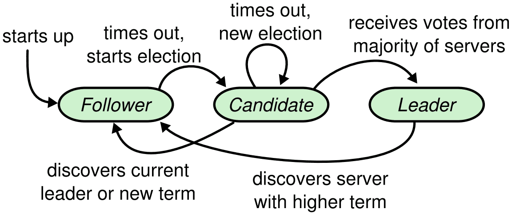
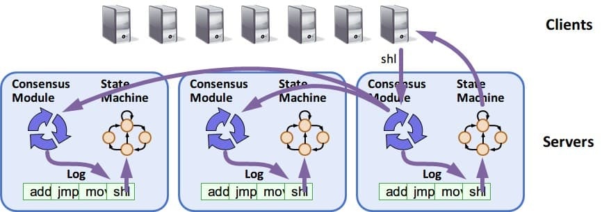
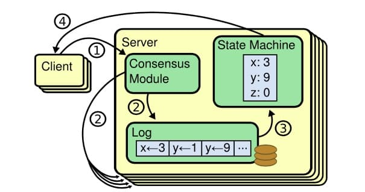
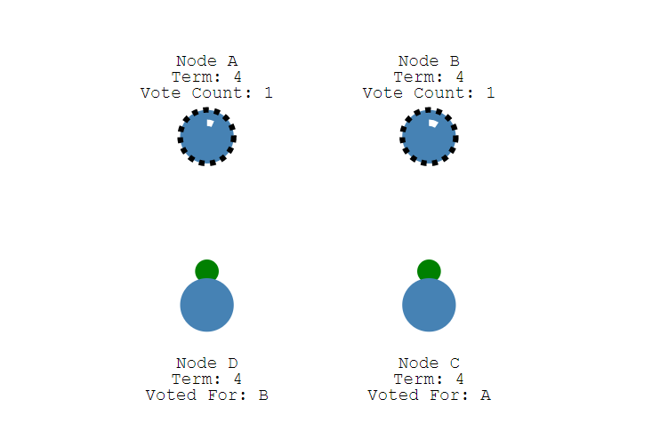
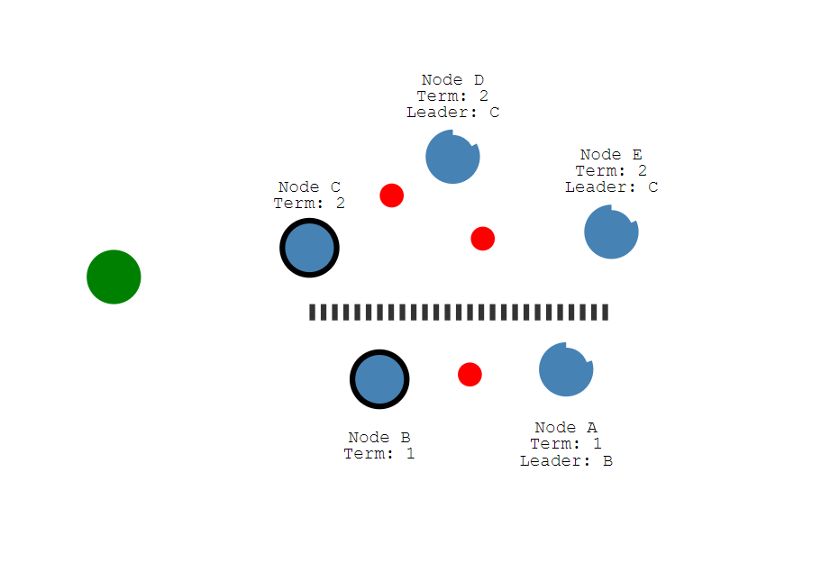
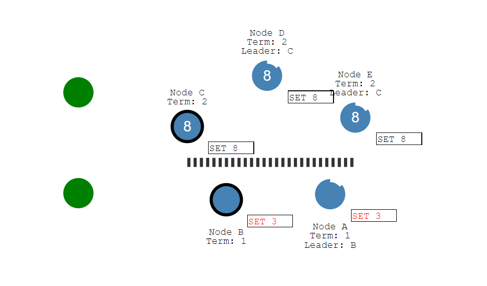
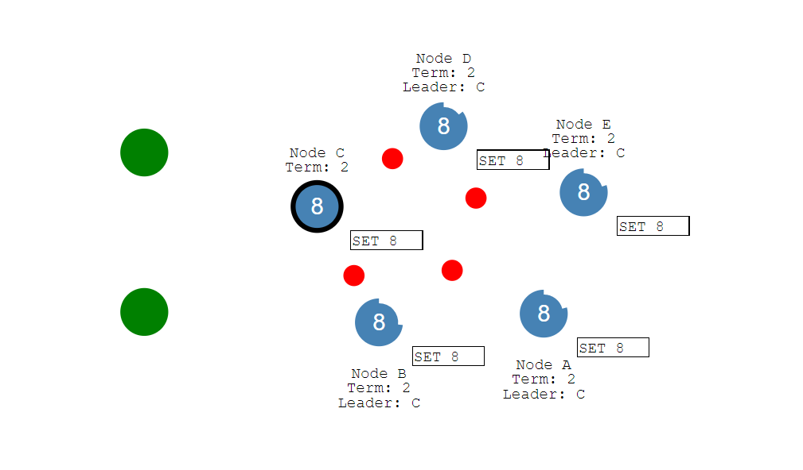

# 分布式一致性与共识之（一）Raft

[TOC]

## Raft基础

在raft中，服务器节点共有3种状态（或者说角色）：

- leader
  - 负责client交互和log复制，同一时刻系统中最多存在1个。
- follower
  - 节点的初始状态就是follower，follower只能被动响应请求RPC，从不主动发起请求RPC。
  - 如果follower在一定时间范围（后面会讲，这个叫election timeout）内没有收到leader的请求，则follower可以转变成candidate（If followers don't hear from a leader then they can become a candidate.）
- candidate
  - 一个临时的状态，只存在于选举leader阶段。一个节点想要变成leader，那么就发起投票请求，同时自己变成candidate。如果选举成功，则变为candidate，否则退回为follower。其他节点根据当前状态回复是否，如果已经投票给其他candidate，则不会再投票给这个candidate（一个节点只有一票）。
  - 获得多数选票的candidate（n/2+1）将会变成leader。

3种状态的流转参见此图：

### Raft关键问题

- 领导选取
- 日志复制
- 安全
- 成员变化

Raft采用复制状态机(state machine replication)模型，通过复制日志来保证状态的一致性，详细内容参见wiki https://en.wikipedia.org/wiki/State_machine_replication  基本思想是：

- 日志：每台机器保存一份日志，日志来自于客户端的请求，包含一系列的命令
- 状态机：状态机会按顺序执行这些命令
- 一致性模型：分布式环境下，保证多机的日志是一致的，这样回放到状态机中的状态是一致的

复制状态机机制可以参考这张图：

## Raft算法流程

先看 动画演示 http://thesecretlivesofdata.com/raft/

### 领导选举 leader election

Raft中使用心跳机制来出发leader选举。当服务器启动的时候，服务器成为follower。只要follower从leader或者candidate收到有效的RPCs就会保持follower状态。如果follower在一段时间内（该段时间被称为election timeout）没有收到消息，则它会假设当前没有可用的leader，然后开启选举新leader的流程。

#### 1. 任期 term

Raft算法将时间划分成为任意不同长度的任期（term），任期用连续的数字进行表示。每一个任期的开始都是一次选举（election），一个或多个候选人会试图成为领导人。如果一个候选人赢得了选举，它就会在该任期的剩余时间担任领导人。在某些情况下，选票会被瓜分，有可能没有选出领导人，那么，将会开始另一个任期，并且立刻开始下一次选举。Raft 算法保证在给定的一个任期最多只有一个领导人。

#### 2. RPC

Raft 算法中服务器节点之间通信使用远程过程调用（RPCs），并且基本的一致性算法只需要两种类型的 RPCs，为了在服务器之间传输快照增加了第三种 RPC。

RPC有三种：

- RequestVote RPC：候选人在选举期间发起
- AppendEntries RPC：领导人发起的一种心跳机制，复制日志也在该命令中完成
- InstallSnapshot RPC: 领导者使用该RPC来发送快照给太落后的追随者

#### 3. 选举流程说明

（1）follower增加当前的term，转变为candidate。
（2）candidate投票给自己，并发送RequestVote RPC给集群中的其他服务器。
（3）收到RequestVote的服务器，在同一term中只会按照先到先得投票给至多一个candidate。且只会投票给log至少和自身一样新的candidate。

一个节点node1发起选举后，会发生如下3种情况中的一种：

- a. 该节点赢得选举。即收到大多数的节点的投票。则node1转变为leader状态。
- b. 另一个节点node2成为了leader。即收到了leader的合法心跳包（term值等于或大于当前自身term值）。则node1转变为follower状态。
- c. 一段时间后依然没有胜者。该种情况下会开启新一轮的选举。

#### 4. 2个超时时间：election timeout和heartbeat timeout

##### election timeout

从follower状态成为candidate状态需要等待的时间。在这个时间内，节点必须等待，不能成为candidate状态。

**该超时时长随机**，在150ms-300ms之间，超时后，follower将成为candidate，启动一个新的election term，并投自己一票，并发送request vote 给其他节点。如果接收到的节点在当前term中还未投票（vote），就会将投票给这个candidate，并重置自己的election timeout。

##### heartbeat timeout

心跳超时时间。candidate获得多数选票后将会变成leader，leader将开始发送append entries消息给它的follower，这是一个心跳消息，可能为空，也可能带有需要复制的日志数据，这类消息在heartbeat timeout时间间隔内发送；follower将会响应每个append entries。如果超过心跳超时时间内，follower没收到leader的消息，将会认为leader挂掉、会开始新的选举周期。

有关append entries的解析，可以参考这篇：[Raft系列文章之三：Raft RPC详解](https://blog.csdn.net/chicm/article/details/41909261)

另一方面，这也说明，日志数据实际上都是跟着心跳消息发送给follower的，并不是说client发起一个修改、leader就立马开始同步数据。参见下文“日志复制”相关。

#### 5. 问题：split vote

上述"3.选举流程"中的情况c.，最典型的就是`split vote`，当两个节点同时转变为candidate、发起选举时，就会出现该情况。

假设4个节点的情况，A B分别发起选举，两个节点在同一个term中启动election，并且这两个vote都在对方之前抵达一个单独的节点，此时A B分别拿到2个投票（包括自己投自己的那一票）、且在这个term中不会有更多votes，两个节点都没拿到多数选票。这些节点将会等待、在下个term中启动选举。由于选举超时时间(election timeout)是随机的，这两个candidate节点不可能每次election timeout时间都相同，也就可以保证这个选举过程最终会选出一个leader。

### 日志复制 log replication 

日志复制（Log Replication）主要作用是用于保证节点的一致性，这阶段所做的操作也是为了保证一致性与高可用性。

注意，在Raft中的日志，是指可能引起状态变化的操作，查看操作不引起状态变化、并不包含在下面讨论的日志范围内。

当leader选举出来后便开始负责客户端的请求，所有事务（更新操作）请求都必须先经过leader处理，日志复制（Log Replication）就是为了保证执行相同的操作序列所做的工作。

leader需要将所有数据变化复制给系统中所有节点。这需要用到在维持心跳中用到的append entries消息。

整体流程如下：

- 在Raft中当leader接收到客户端的日志（事务请求）后先把该日志追加到本地的log中，此时的日志是uncommitted的，并不会更新节点值；

- 接着，leader节点将复制这条日志给所有follower节点（数据会通过下一个heartbeat中append entry消息发送给所有follower），follower接收到日志后记录日志然后向leader发送ACK；

- 当leader收到大多数（n/2+1）节点的ACK信息后，leader将这条日志设置为committed、将日志应用到本地的状态机（根据client请求修改状态），并返回给client。

可以参考这篇[Raft 日志复制 Log replication](https://www.jianshu.com/p/b28e73eefa88)

### 网络分区问题与解决 network partition

Raft在面对网络分区问题时仍能保证一致性。
假设，由于网络分区，导致一个Raft集群分成了两部分，有2个leader

此时若有client去更新数据，如果分区内能够达到整个集群的多数，就能commit成功，但可能出现以给一个分区提交成功、另外一个分区的节点无感知。
如

故障恢复时，重新接入的分区会比较election term，比较高版本的leader的日志，使得自身的版本与新版本一致

这样整个集群将会恢复成一致的状态。

## Raft的算法实现与应用

Raft算法的论文相比Paxos直观很多，更容易在工程上实现。

目前Raft算法实现已经很多，参见: https://raft.github.io/#implementations

### 应用场景

典型的如etcd、nacos等。

etcd目标是构建一个高可用的分布式键值（key-value）数据库，基于 Go 语言实现。Etcd 主要用途是共享配置和服务发现，实现一致性使用了Raft算法。

etcd参见https://etcd.io/

## 其他

本文主要参考、整理自 https://www.cnblogs.com/binyue/p/8647733.html  这篇文章还有一些内容不错，引用如下：

>## 三、Raft和Paxos的工程应用
>
>......
>
>#### 2.Zookeeper 中的 Paxos
>
>Zookeeper 使用了一种修改后的 Paxos 协议。
>
>在 Zookeeper 中，始终分为两种场景:
>
>- Leader activation
>
>在这个场景里，系统中缺乏 Leader(primary)，通过一个类似 paxos 协议的过程完成 Leader 选举。
>
>- Active messaging
>  在 这个场景里，Leader 接收客户端发送的更新操作，以一种类似两阶段提交的过程在各个 follower (secondary)节点上进行更新操作。
>
>在 Leader activation 场景中完成 leader 选举及数据同步后，系统转入 Active messaging 场景，在 active messaging 中 leader 异常后，系统转入 Leader activation 场景。
>
>无论在那种场景，Zookeeper 依赖于一个全局版本号:zxid。zxid 由(epoch, count)两部分组成， 高位的 epoch 部分是选举编号，每次提议进行新的 leader 选举时 epoch 都会增加，低位的 count 部分 是 leader 为每个更新操作决定的序号。可以认为，一个 leader 对应一个唯一的 epoch，每个 leader 任期内产生的更新操作对应一个唯一的有序的 count，从而从全局的视野，一个 zxid 代表了一个更新操作的全局序号(版本号)。
>
>Zookeeper 通过 zxid 将两个场景阶段较好的结合起来，且能保证全局的强一致性。由于同一时刻只有一个 zookeeper 节点能获得超过半数的 follower，所以同一时刻最多只存在唯一的 leader;每个 leader 利用 FIFO 以 zxid 顺序更新各个 follower，只有成功完成前一个更新操作的才会进行下一个更新操作，在同一个 leader 任期内，数据在全局满足 quorum 约束的强一致，即读超过半数的节点 一定可以读到最新已提交的数据;每个成功的更新操作都至少被超过半数的节点确认，使得新选举 的 leader 一定可以包括最新的已成功提交的数据。
>
>#### 3.如何解决split brain问题
>
>分布式协议一个著名问题就是 split brain 问题。
>
>简单说，就是比如当你的 cluster 里面有两个结点，它们都知道在这个 cluster 里需要选举出一个 master。那么当它们两之间的通信完全没有问题的时候，就会达成共识，选出其中一个作为 master。但是如果它们之间的通信出了问题，那么两个结点都会觉得现在没有 master，所以每个都把自己选举成 master。于是 cluster 里面就会有两个 master。
>
>区块链的分叉其实类似分布式系统的split brain。
>
>一般来说，Zookeeper会默认设置：
>
>- zookeeper cluster的节点数目必须是奇数。
>- zookeeper 集群中必须超过半数节点(Majority)可用，整个集群才能对外可用。
>
>Majority 就是一种 Qunroms 的方式来支持Leader选举，可以防止 split brain出现。奇数个节点可以在相同容错能力的情况下节省资源。
>
>## 四、从CAP的角度理解几种不同的算法
>
>#### 1.两阶段提交协议
>
>两阶段提交系统具有完全的C，很糟糕的A，很糟糕的P。
>首先，两阶段提交协议保证了副本间是完全一致的，这也是协议的设计目的。再者，协议在一个节点出现异常时，就无法更新数据，其服务可用性较低。最后，一旦协调者与参与者之间网络分化，无法提供服务。
>
>#### 2.Paxos和Raft算法
>
>Paxos 协议和Raft算法都是强一致性协议。Paxos只有两种情况下服务不可用:一是超过半数的 Proposer 异常，二是出现活锁。前者可以通过增加 Proposer 的个数来 降低由于 Proposer 异常影响服务的概率，后者本身发生的概率就极低。最后，只要能与超过半数的 Proposer 通信就可以完成协议流程，协议本身具有较好的容忍网络分区的能力。
>
>参考
>[Raft一致性算法](https://blog.csdn.net/cszhouwei/article/details/38374603)
>[Raft 一致性算法论文译文](http://www.infoq.com/cn/articles/raft-paper)
>
>

## 参考资料

- [从分布式一致性到共识机制（二）Raft算法](https://www.cnblogs.com/binyue/p/8647733.html)
- [Raft协议中的两种超时](https://www.hellodemos.com/hello-raft-text/raft-text-raft-overtime.html)
- [Raft系列文章之三：Raft RPC详解](https://blog.csdn.net/chicm/article/details/41909261)
- [Raft 日志复制 Log replication](https://www.jianshu.com/p/b28e73eefa88)